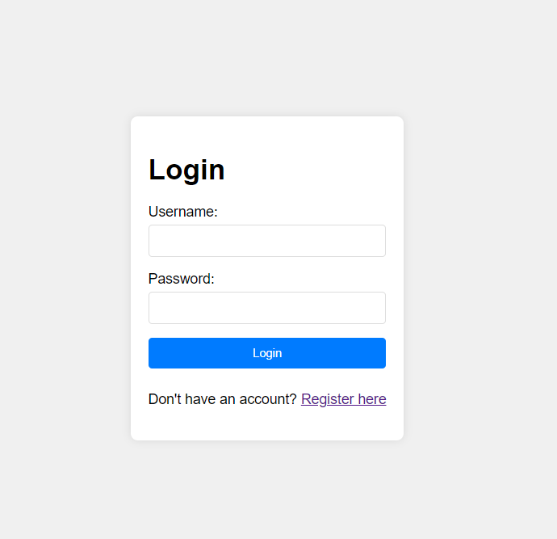

# ShareGo

ShareGo is a file sharing application that allows users to register, log in, upload files, and manage them. The application uses a Go backend with SQLite for data storage and simple HTML/CSS/JavaScript for the frontend.

## Features

- **User Registration and Login**: Users can create accounts and log in to access file management features.
- **File Upload**: Users can upload files to the server.
- **File Management**: Users can view and download their uploaded files.
- **Frontend**: Simple and responsive web interface.

## Installation

1. **Clone the repository:**

   ```bash
   git clone https://github.com/kaynhvh/sharego.git
   cd sharego
   ```

2. **Install Go dependencies:**

   ```bash
   go mod tidy
   ```

3. **Run the application:**

   ```bash
   make run
   ```

4. **Access the application:**

   Open your web browser and go to `http://localhost:8080`.

## To-do list

This project was written in only one day, but it will be continued.
<br>I have planned the following:

- [ ] Improve UI design
- [ ] Add user profile management
- [ ] Make auto-destruction files
- [ ] Add file search option
- [ ] Optimize performance for handling large files

## Screenshots

### Register Page


### Login Page


### Upload Page


### Files Page

